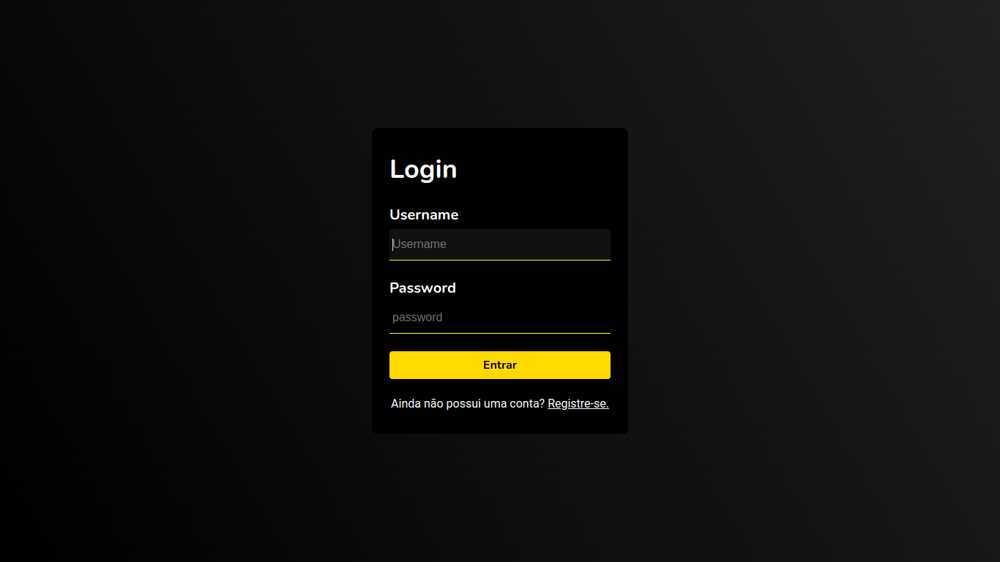
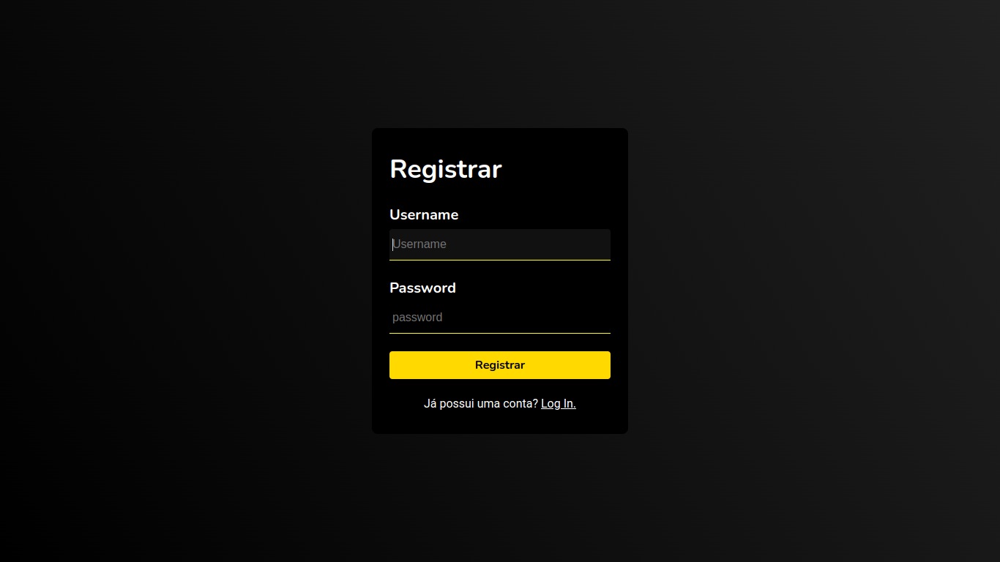
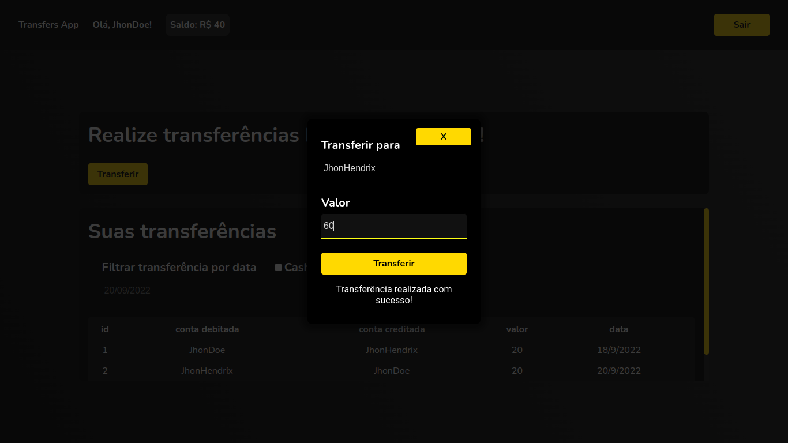
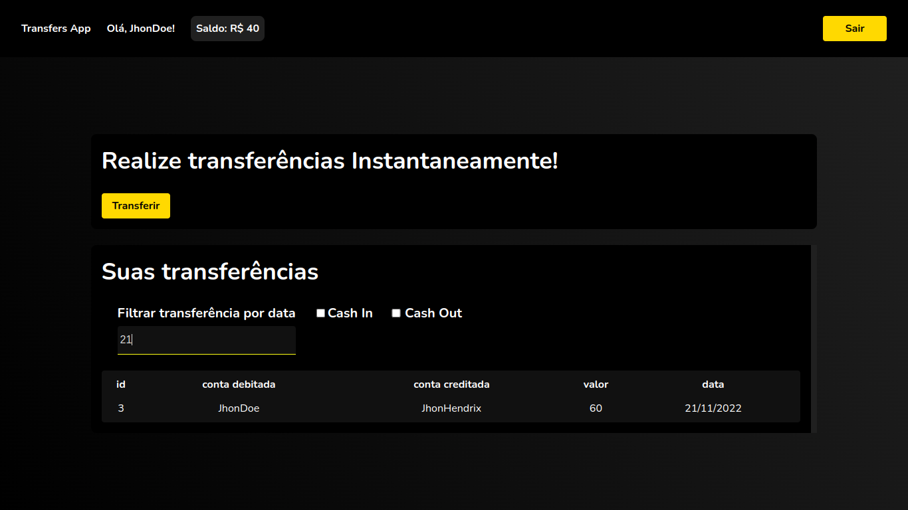
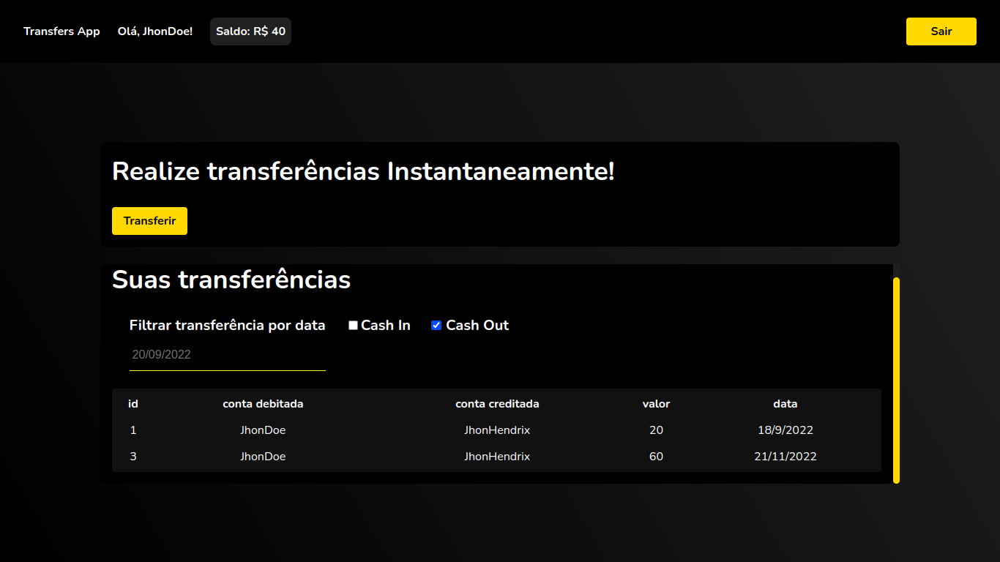

<div>

  ## Seja bem vindo(a) ao Transfers App!

    Aplicação que possibilita que os usuários consigam realizar transferências internas entre si.

  - ### backend:
    - Desenvolvimento de API REST com TypeScript e Node.js;
    - ORM: Prisma
    - PostgreSQL;
  
  - ### frontend:
    - Desenvolvimento das interfaces com React.js e TypeScript;
    - Testes com a biblioteca React Testing Library;
    - Requisições da API com a biblioteca Axios;

  - ### Demais ferramentas:

    Editor | DevOps
    
    
    
    
    
</div>
  <br />

<div>

  ## Para rodar locamente:

  1. Clone o repositório com o comando ```git clone git@github.com:guihtryb/transfers-app.git``` em seu terminal;
  2. Entre na pasta criada transfers-app com o comando ```cd transfers-app``` em seu terminal;
  3. Instale as depêndencias do frontend do projeto com o comando ```cd app/backend/server``` seguido de ```yarn```, ou ```npm install``` em seu terminal;
  3. Instale as depêndencias do frontend do projeto com o comando ```cd ../../frontend/transfers-app``` seguido de ```yarn```, ou ```npm install``` em seu terminal;

  ### Backend
  
  1. Entre na pasta app/backend/server e execute o comando ```npx prisma migrate dev``` para criar e popular o Banco de dados;
  2. Por fim execute o comando ```npm run dev``` para iniciar servidor;

  ### Frontend

  1. Entre na pasta app/frontend/transfers-app, e , já com as dependências instaladas, execute o comando ```npm run dev``` e abra uma uma aba no seu navegador no endereço ```http://localhost:5173/``` para visualizar a aplicação;

  ### Telas da aplicação

  ## Login:

  - Para logar com um usuário existente.
  - Caso não tenha uma conta, clique em "Registre-se", abaixo dos campos de login;

    

  ### Register:

  - Crie uma conta para logar no App.
  - Atente-se às regras: 
      1. Nome de usuário: Mínimo de três caracteres;
      2. Senha: 
        - Mínimo de 8 caracteres;
        - Deve conter 1 número;
        - Deve conter 1 letra maiúscula;
  - A conta será criada, possuindo um saldo inicial de R$100,00 e usuário será redirecionado para a rota /home

    

  ## Home

  - Essa página permite realizar e visualizar transferências!
  - Para realizar uma transferência, clique em transferir, e uma modal para transferência será aberta.
  - Então, digite um usuário para o qual queira transferir e o valor da transferência.

  - Caso queira simular uma transferência, use os nomes de usuário ```JhonDoe``` ou ```JhonHendrix```, usuários já presentes na base de dados!

    

  ### Filtrando transferências

  - É possível filtrar suas transferências por data, Cash In (em que sua conta foi creditada), e Cash Out (em qual sua conta foi debitada)

    
    
    

</div>

